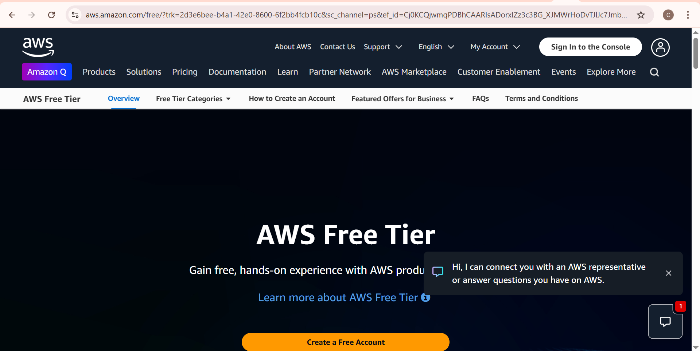

# AWS_Account_Creation

## What Is Cloud?
Cloud computing is the delivery of computing services—like storage, servers, databases, software, and more—over the internet. Instead of saving files or running programs on your local computer, the cloud allows you to access these resources online, from anywhere, at any time.

It helps individuals and businesses save cost, scale easily, and improve accessibility. Common examples include services like Google Drive, iCloud, and Microsoft Azure.

## What Is AWS Cloud?
Amazon Web Services (AWS) is the world’s leading cloud computing platform. It offers a wide range of on-demand services such as storage, computing power, databases, networking, machine learning, and more — all accessible over the internet.

With AWS, individuals and businesses can:
1. Host websites and apps
2. Store large amounts of data securely
3. Run virtual servers
4. Stream video and content
5. Build and scale software efficiently

Key Benefits:
1. Pay-as-you-go pricing model
2. Global infrastructure across data centers in many regions
3. High reliability and security
4. Scalability for small startups to large enterprises

Examples of AWS services:
1. EC2 – virtual servers
2. S3 – cloud storage
3. RDS – managed databases
4. Lambda – serverless computing

AWS powers major companies and government institutions worldwide and is widely used in IT, healthcare, finance, and education.

## Creating AWS Account:
1. Opened AWS website at https://aws.amazon.com/

2. Clicked on Create Free Account

3. Clicked Sign Up

4. Entered the required details:
Email address  
Password  
AWS Account name

5. Verified The Email: Copied the verification number sent to my email and pasted it in the required field.

6. Set up Root User password:

7. Next page, I filled out my personal information

8. Then I provided my payment information

9. I entered the OTP sent to me

10. Next I verified my identity through SMS

11. Then I chose a support plan: Free support

12. Then I clicked "Goto AWS Management Console" to access my account

13. I entered "Personalize Your Experience"

14. Clicked "Sign in to the console"

15. I selected "Root User" and entered my registered email address, then clicked "Next" to proceed.

16. I entered the captcha

17. Finally I entered my password and clicked "Sign In"

This is how I was able to create my AWS account.